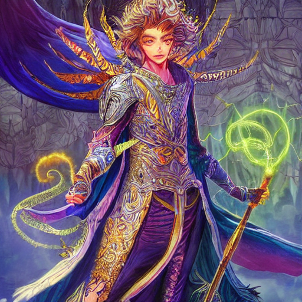
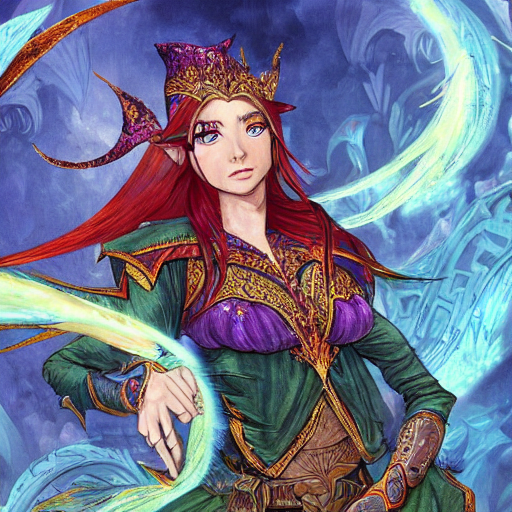

# Game Story and Character Generator

This project focuses on developing a program that generates unique game stories and characters based on predefined genres and themes. The primary goal is to create engaging narratives and well-defined characters suitable for various types of games.

## Overview

The project is structured around the following objectives:

- Random generation of game stories within specific genres (e.g., fantasy, sci-fi, mystery).
- Creation of detailed character profiles with attributes such as name, backstory, personality traits, and skills.
- Customization options to adjust themes, settings, and complexity of generated content.

## Features

1. **Story Generator**: Automatically generates unique game scenarios based on selected genres and themes.
2. **Character Creator**: Creates dynamic character profiles with distinct attributes and backstories.
3. **Customizability**: Allows users to specify parameters like genre, tone, and complexity for tailored results.

## Steps Implemented

1. Designing templates and rules for story and character generation.
2. Integrating machine learning models from **Hugging Face** for natural language generation.
3. Developing a user interface or command-line tool for interaction and customization.

## Technologies Used

- **Hugging Face**: For leveraging pre-trained language models to generate coherent and creative text.
- **Python**: For implementing the logic and structure of the generator.

## Key Benefits

This project serves as a powerful tool for game developers and storytellers, enabling rapid prototyping of game ideas and enriching the creative process. By utilizing state-of-the-art AI models, it delivers high-quality, engaging content tailored to user preferences.

## Installation

1. Clone this repository:
   ```bash
   git clone https://github.com/your-username/game-story-character-generator.git
   ```
2. Install the required dependencies:
   ```bash
   pip install -r requirements.txt
   ```
3. Run the program:
   ```bash
   python main.py
   ```

## Example Outputs

### Character Profile


### Character Profile


## Future Improvements

- Adding support for additional genres and character archetypes.
- Enhancing customization options for more nuanced storytelling.
- Developing a graphical user interface for improved user experience.

## Conclusion

This project demonstrates the potential of AI-driven tools in game development by automating the creation of stories and characters. It offers a flexible and scalable solution for enhancing creativity and productivity in the gaming industry.

